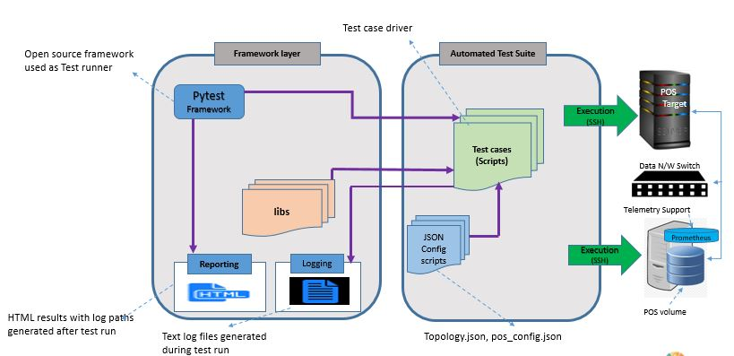

# Introduction
## Background
Poseidon OS (POS) is a light-weight storage OS that offers the best performance and valuable features over NVMeOF. 
It is optimized for low-latency and high-throughput NVMe devices. 
It support NVMe-over-Fabrics interface over RDMA and TCP. As part of continued efforts by Samsung to contribute back to open source community, 
POS is open sourced. It can be downloaded from https://www.github.com/poseidonos. 
POS can be explored by using the in-built CLI command sets. This User Guide introduces the open source community with a test suite named as Trident. 
User can refer to this user guide to setup and use Trident.

## Design
Trident is collection of libraries and sample test cases developed using pytest framework. 
Libraries are developed in pure python in order to give the choice of framework to user. 
However, test cases are developed using pytest framework. The software architecture for Trident is depicted in the diagram below.

|  |
| :--: |
| *Figure 1 : Software Architecture* |

Since it is developed on top of free and open technologies, Trident is both open and extensible.

### Open. 
Source code is available open for anyone to explore at following link http://ssirgitlab.samsungds.net/root/open_ibot.git. 
User can develop their own test cases utilising framework independent python libraries. 
As the framework for test cases is based on pytest, all advantages of pytest can be utilised by user to have efficient test cases.

### Extensible. 
Test suite provides core, intermediate APIs and following set of test cases:
* Array, Volume management (create, delete, rename single and multi-arrays)
* User IO (Block, File IO, various IO types e.g. sync/async)
* Array rebuild (SSD hot plug)
* GC and flush

## Preparing system for Trident Open source tool
### Software requirements 
#### Poseidon OS
* OS: Ubuntu 18.04 (kernel: 5.3.0-19-generic)
* GCC: 7.5.0 or later
* SPDK/DPDK: 20.10 / 20.08

#### Trident 
* Python 3.x
* Pytest (Ubuntu 18.04 repo)
* Paramiko (Python3 module)

### Pre-requisites for Project Poseidon
Poseidon OS can be cloned from following link 
    
`$git clone https://github.com/poseidonos/poseidonos.git`
    
Navigating to script folder and execute pkgdep.sh script downloads and installs all dependencies of the project.

Please refer to https://github.com/poseidonos/poseidonos/blob/main/README.md for further details.

### Pre-requisites for Trident Open source
Test suite is primarily based on Python3 and pytest. It is important to check if Python3 is already installed. Pip3 (python3-pip) also need to be installed as it is used to install all requirements for the test framework. After installation, update pip3 by running below command
   
`$pip3 install --upgrade pip`
   
To install the pre-requisites run following command:
   
`$pip3 install -r requirements.txt`

## Directory structure of Trident
Trident can be cloned from below git link
    
`$git clone https://github.com/poseidonos/trident.git`
    
### Trident is organised in to following directories:
#### Lib: 
Library functions are distributed in to different file depending on the functionality

File|Description
----|-----------
cli.py|This file contains class implementing all CLI commands that POS supports.
pos.py|This file is wrapper for cli and other modules.
logger.py|Customization over python logger modules
node.py|APIs needed for implementing paramiko module
proc.py|Process related API
utils.py|APIs related to various operations such as creating/mounting file-systems, NVMe commands, threading and many more.
target_utils.py|Target side API wrappers


### Docs: 
To generate API documentation of libraries, Doxygen tool is to be used. It can be done by installing doxygen: 
    
`$sudo apt-get install doxygen`
    
Documents are generated by entering directory open_ibot/ibot/docs/doxygen and run command

`$doxygen`
    
### Testcases: 
Contains test case scripts classified in to different directories. Each directory contains at least one test driver file. 
Each test driver file implements methods which work as one or more test cases.

File or Folder|Description
--------------|-----------
conftest.py|Defined the fixture functions in this file to make them accessible across multiple test files. 
array|All array management TCs
volume| All volume management TCs
user-io| All IO test cases
config_files| This directory has topology.json which holds setup parameters such as target/initiator IP addresses etc

### Utils: 
This directory contains setup_tool.py, a tool to check user setup has SSDs supported by POS, all IPs are on same network and basic POS functionalities are working.

# Pytest framework
Pytest provides features which enable tester to write test code in well organised way. Following features of pytest are utilised here: fixtures and parametrization. 
Hence Trident uses pytest as base framework. Libraries are developed in pure python and do not depend on pytest. But the Test cases depend on pytest framework. 
If user decides to use any other test runner such as Avocado, he can still use the lib folder as is. 

## Fixtures
Pytest fixtures are powerful tools which make resources available across all the test methods. Trident open source test tool provides following fixtures

Fixture | Scope | Description
--------|-------|------------
start_pos|Module| Common code to start and stopp POS
scan_dev| Module| Code for test cases that require starting POS and steps till scan device. TCs can focus on steps post scan devices. 
array_management|Module|Code for test cases that require starting POS and steps till creation of array. TCs can focus on steps post array creation.  
mount_array|Module|Code for test cases that require starting POS and steps till mounting of array. TCs can focus on steps after array is mounted
vol_fixture|Module|Code for test cases that require steps till creation of volumes. TCs can focus on steps after volumes are created
nvmf_transport|Module|Code for test cases that require steps till subsystem creation and listening on to one port. TCs can focus on steps after target is setup.
user_io|Module| Code covers target setup and connect from initiator. TC can simply focus on what user IO to exercise.


# Execution
Poseidon OS requires two systems, target and minimum one initiator. A target is any commodity server or PC with Ubuntu 18.04 server with kernel version 5.3.0-19-generic. 
Initiator currently supported is Ubuntu 18.04 with same kernel version. Trident can be installed on to a third executor machine which can be a PC or VM running any Linux variant. 

|  |
| :--: |
| *Figure 2 : Test Setup* |

Test can also be run on single system by updating local loop IP for target, initiator machine and data network interfaces in configuration file present in testcases/config_files/topology.json.
Setup tool present in utils directory can be used to make sure, multi system setup that user has selected is good enough to run the tests.

## Executing test cases using pytest runner
Navigate to iBot directory after cloning the test tool
### Executing all available test cases
`python3 -m pytest -v testcase/`
### Executing only user IO test cases
`python3 -m pytest -v testcase/user-io/`
### Executing test cases from particular test driver file
`python3 -m pytest -v testcase/user-io/test_user_io.py`
### Executing particular method in particular driver file
`python3 -m pytest -v testcase/user-io/test_user_io.py::test_run_file_io`
### In case of parametrization, following method enables executing one of the combination
`python3 -m pytest -v testcase/user-io/test_user_io.py::test_run_file_io[posixaio-xfs]`

# Test case examples
In this section we will see some examples of test script, more can be seen from folder testcases in the package.

Example 1. Hello world (creating a POS array)

In the below example TC, intension is to just test array creation operation without having a spare evice.
```
def test_create_array_with_out_spare(scan_dev):
    try:
        assert scan_dev.cli.create_array(spare=None) == True
    except Exception as e:
        logger.error("Testcase failed due to {}".format(e))
        assert 0
```

Example 2 Volume operations

In below example test method is passed vol_fixture, so that test can concentrate only on task at hand which is to unmount and delete the volumes. 
All pre-requisites are run as part of vol_fixture, any failures in fixture will skip the test case stating the error scenario.
 
 ```
 def test_vol_mount_unmount_delete(vol_fixture):
    try:
        vols = []
        out = vol_fixture.cli.list_vol(array_name="POS_ARRAY1")
        for vol_data in out[2]:
            assert vol_fixture.cli.unmount_vol(vol_data, "POS_ARRAY1") == True
            assert vol_fixture.cli.delete_vol(vol_data, "POS_ARRAY1") == True
    except Exception as e:
        logger.error("test case failed with exception {}".format(e))
        assert 0
```
Example 3 File-system IO
This example demonstrates IO on Poseidon volume connected via NVMeOf, by formatting the volume in 3 file-systems and 3 IO types, totally 9 combinations.

```
@pytest.mark.parametrize("fs_type", ["ext3","ext4","xfs"])
@pytest.mark.parametrize("io_engine", ["posixaio", "sync", "libaio"])
def test_run_file_io(user_io,fs_type,io_engine):
    try:
        dev_list = user_io["client_setup"].nvme_list_out
        user_io["client_setup"].create_FS(dev_list = dev_list, format_type=fs_type)
        dev_fs_list = user_io["client_setup"].mount_FS(dev_list = dev_list)[1]
        fio_cmd = "fio --name=S_W --runtime=5 --ioengine={} --iodepth=16 --rw=write --size=1g --bs=1m ".format(io_engine)
        user_io["client_setup"].fio_generic_runner(devices  = dev_fs_list, fio_data = fio_cmd, io_mode = False)
        user_io["client_setup"].unmount_FS(unmount_dir = dev_fs_list)
    except Exception as e:
        logger.error("test case failed with exception {}".format(e))
        user_io["client_setup"].unmount_FS(unmount_dir = dev_fs_list)
        assert 0
```

# Contributing
This test suite is being released as open source with intention of providing open framework that people can utilise and extend. 
Individuals can contribute in various ways to this project by filing bugs, contributing patches and providing more documentation by improving this guide.


