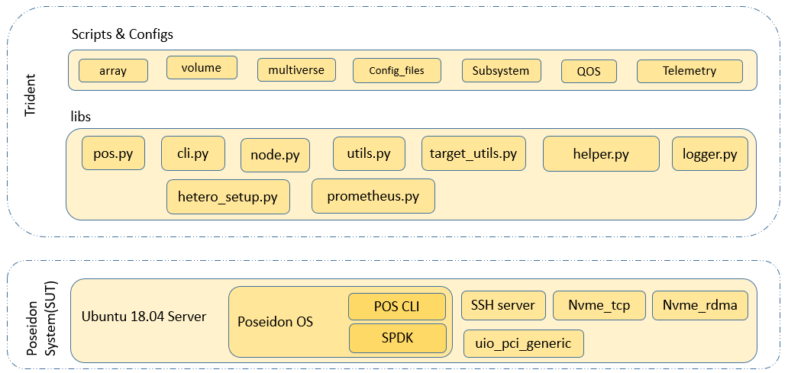

# Introduction
## Background
Poseidon OS (POS) is a light-weight storage OS that offers the best performance and valuable features over NVMeOF. 
It is optimized for low-latency and high-throughput NVMe devices. 
It support NVMe-over-Fabrics interface over RDMA and TCP. As part of continued efforts by Samsung to contribute back to open source community, 
POS is open sourced. It can be downloaded from https://www.github.com/poseidonos. 
POS can be explored by using the in-built CLI command sets. This User Guide introduces the open source community with a test suite named as Trident. 
User can refer to this user guide to setup and use Trident.

## Design
Trident is collection of libraries and sample test cases developed using pytest framework. 
Libraries are developed in pure python in order to give the choice of framework to user. 
However, test cases are developed using pytest framework. The software architecture for Trident is depicted in the diagram below.

|  |
| :--: |
| *Figure 1 : Software Architecture* |

Since it is developed on top of free and open technologies, Trident is both open and extensible.

### Open. 
Source code is available open for anyone to explore at following link https://github.com/poseidonos/trident . 
User can develop their own test cases utilising framework independent python libraries. 
As the framework for test cases is based on pytest, all advantages of pytest can be utilised by user to have efficient test cases.

### Extensible. 
Test suite provides core, intermediate APIs and following set of test cases:
* Array, Volume, SubSystem, QOS management (create, delete, rename single and multi-arrays)
* Array rebuild (SSD hot plug)
* GC and flush
* Other POS functionalities

## Preparing system for Trident Open source tool
### Software requirements 
#### Poseidon OS
* OS: Ubuntu 18.04 (kernel: 5.3.0-19-generic)
* GCC: 7.5.0 or later
* SPDK/DPDK: 20.10 / 20.08

#### Trident 
* Python 3.8
* Pytest (Ubuntu 18.04 repo)
* Paramiko (Python3 module)

### Pre-requisites for Project Poseidon
Poseidon OS can be cloned from following link 
    
`$git clone https://github.com/poseidonos/poseidonos.git`
    
Navigating to script folder and execute pkgdep.sh script downloads and installs all dependencies of the project.

Please refer to https://github.com/poseidonos/poseidonos/blob/main/README.md for further details.

### Pre-requisites for Trident Open source
Test suite is primarily based on Python3 and pytest. It is important to check if Python3 is already installed. Pip3 (python3-pip) also need to be installed as it is used to install all requirements for the test framework. After installation, update pip3 by running below command
   
`$pip3 install --upgrade pip`
   
To install the pre-requisites run following command:
   
`$pip3 install -r requirements.txt`

## Directory structure of Trident
Trident can be cloned from below git link
    
`$git clone https://github.com/poseidonos/trident.git`
    
### Trident is organised in to following directories:
#### Lib: 
Library functions are distributed in to different file depending on the functionality

File|Description
----|-----------
cli.py|This file contains class implementing all CLI commands that POS supports.
pos.py|This file is wrapper for cli and other modules.
logger.py|Customization over python logger modules
node.py|APIs needed for implementing paramiko module
proc.py|Process related API
utils.py|APIs related to various operations such as creating/mounting file-systems, NVMe commands, threading and many more.
target_utils.py|Target side API wrappers
helper.py| methods contains API wrappers that can be used on both target and the host
hetero_setup.py|APIs to support and configure NVMe disk to create hetero setup
pos_config.py|APIs to update and reset the pos.conf during test execution
prometheus.py|APIs to access prometheus DB

### Docs: 
To generate API documentation of libraries, Doxygen tool is to be used. It can be done by installing doxygen: 
    
`$sudo apt-get install doxygen`
    
Documents are generated by entering directory open_ibot/ibot/docs/doxygen and run command

`$doxygen`
    
### Testcases: 
Contains test case scripts classified in to different directories. Each directory contains at least one test driver file. 
Each test driver file implements methods which work as one or more test cases.

File or Folder|Description
--------------|-----------
conftest.py|Defined common fixtures to setup test infra(pytest infra). 
array| All array management TCs
volume| All volume management TCs
user-io| All GC/flush test cases
subsystem | All Subsystem managment TCs
config_files| This directory has topology.json which holds setup parameters such as target/initiator IP addresses etc
telemetery| This directory is there to test telemetery feature

### Utils: 
This directory contains setup_tool.py, a tool to check user setup has SSDs supported by POS, all IPs are on same network and basic POS functionalities are working.

# Pytest framework
Pytest provides features which enable tester to write test code in well organised way. Following features of pytest are utilised here: fixtures and parametrization. 
Hence Trident uses pytest as base framework. Libraries are developed in pure python and do not depend on pytest. But the Test cases depend on pytest framework. 
If user decides to use any other test runner such as Avocado, he can still use the lib folder as is. 

# Execution
Poseidon OS requires two systems, target and minimum one initiator. A target is any commodity server or PC with Ubuntu 18.04 server with kernel version 5.3.0-19-generic. 
Initiator currently supported is Ubuntu 18.04 with same kernel version. Trident can be installed on to a third executor machine which can be a PC or VM running any Linux variant. 

|  |
| :--: |
| *Figure 2 : Test Setup* |

Test can also be run on single system by updating local loop IP for target, initiator machine and data network interfaces in configuration file present in testcases/config_files/topology.json.
Setup tool present in utils directory can be used to make sure, multi system setup that user has selected is good enough to run the tests.

## Executing test cases using pytest runner
Navigate to Trident directory after cloning the test tool
### Executing all available test cases
`python3 -m pytest -v -s testcase/`
### Executing only sanity suite
`python3 -m pytest -v -s testcase/ -m 'sanity' `

# Test case examples
In this section we will see some examples of test script and the scope provided, more can be seen from folder testcases in the package.

Example 1.Array Management

In the below example TC, The parameters mentioned creates all possible combinations of test to validate array management
```
@pytest.mark.sanity
@pytest.mark.parametrize("writeback" , [True, False])
@pytest.mark.parametrize("raid_type", list(raid.keys()))
@pytest.mark.parametrize("numvol", [1,256])
@pytest.mark.parametrize("fioruntime", [10])
@pytest.mark.parametrize("spor", [False]) #To enable SPOR add True in the list
def test_SanityArray(raid_type, writeback, numvol, fioruntime, spor):
```

Example 2 Volume Management

The Below Test provides a sample Scenario which requests the POS cli to create a 257th volume which is intended to fail as POS only supports 256 Vols per array
 ```

@pytest.mark.sanity()
def test_volumesanity257vols(array_fixture):
    array_name = "array1"
    try:
        if pos.target_utils.helper.check_pos_exit() == True:
            assert pos.target_utils.pos_bring_up(data_dict=pos.data_dict) == True
            assert pos.cli.devel_resetmbr()[0] == True
            assert pos.target_utils.pci_rescan() == True
        assert pos.cli.device_list()[0] == True
        assert pos.cli.array_create(array_name="array1", data=pos.cli.dev_type['SSD'][0:5], write_buffer= pos.cli.dev_type['NVRAM'][0], raid_type= "RAID5", spare = [])[0] == True
        assert pos.cli.array_unmount(array_name="array1")[0] == True
        for i in range(256):
            vname = f'array1_vol{str(i)}'
            assert pos.cli.volume_create(volumename=vname, array_name="array1",size = "1gb")[0] == True
        assert pos.cli.volume_create(volumename="invalidvol", array_name="array1",size = "1gb")[0] == False
        
    except Exception as e:
        logger.error(f" ======= Test FAILED due to {e} ========")
        assert 0
  
```

# Contributing
This test suite is being released as open source with intention of providing open framework that people can utilise and extend. 
Individuals can contribute in various ways to this project by filing bugs, contributing patches and providing more documentation by improving this guide.


